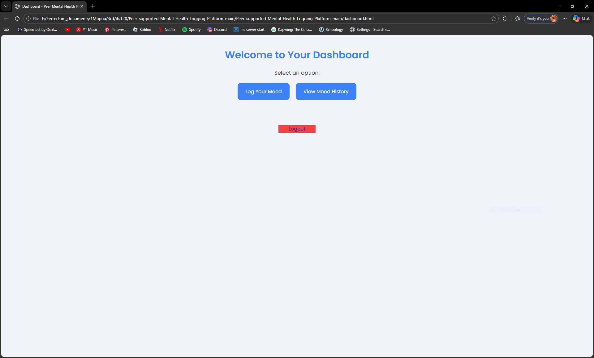
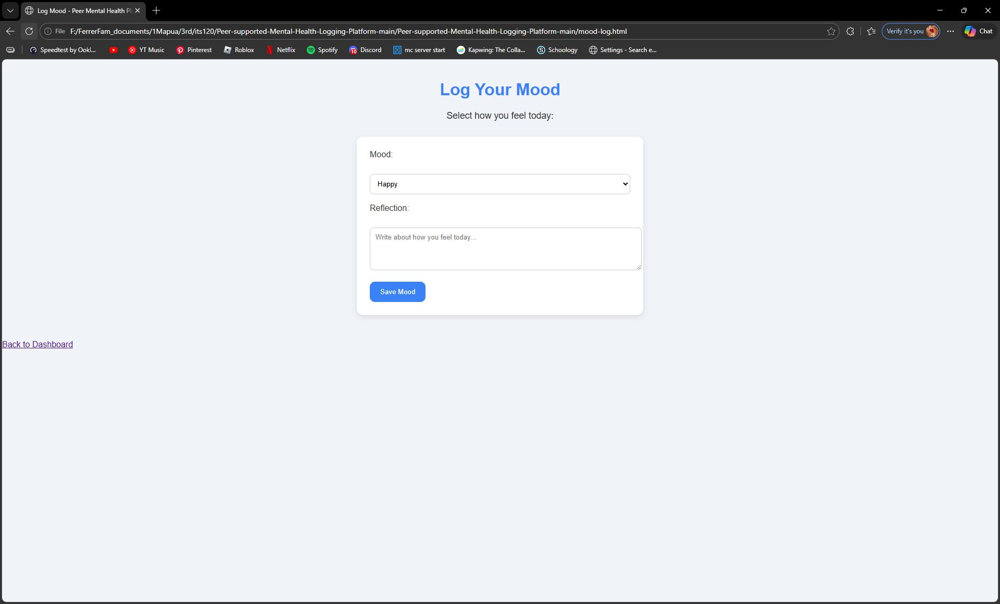

# Peer-supported-Mental-Health-Logging-Platform
This project is a simple web-based platform that helps users track their moods and reflect on their mental health. Users can log their mood, write reflections, and view their mood history over time. The platform demonstrates core features such as login/register, dashboard navigation, mood logging, and mood history display.

## Features Implemented

- **Login/Register Pages** – Users can create an account or log in.  
- **Dashboard** – Central hub for navigating to mood features.  
- **Mood Log Page** – Users can select their mood for the day and write a reflection.  
- **Mood History Page** – Users can view all previous mood logs in a table.

## Repository Structure
## Screenshots

### Dashboard

### Mood Log

### Mood History

